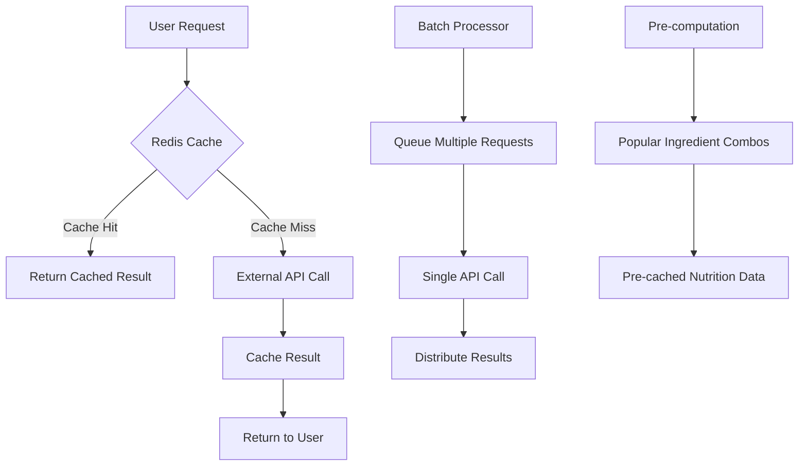

# 🚀 FridgeWise Improvement Roadmap
*Strategic Plan for Performance, Scalability & Growth*

## 📊 **CURRENT STATUS ANALYSIS**

### ✅ **Achievements (Phase 1 Complete)**
- **Full-stack MVP**: Node.js + MongoDB + Vue.js 3 + TypeScript
- **Core Features**: AI ingredient detection, recipe matching, user auth, freemium model
- **Production-Ready**: Docker containerization, error handling, validation
- **Modern UX**: Responsive design, Tailwind CSS, smooth animations
- **Business Model**: Freemium pricing ($4.99/month) with usage tracking

### ⚠️ **Critical Issues Identified**

#### 1. **API Cost Sustainability Crisis**
```
Current Cost Analysis (1000 active users/month):
- OpenAI Vision API: $200-400/month (3-8 photos/user)
- Spoonacular API: $50-100/month 
- Cloudinary: $50-80/month
TOTAL: $300-580/month

Break-even Reality: 200-250 premium users (not 150 as estimated)
Risk: Unsustainable unit economics at scale
```

#### 2. **Performance Bottlenecks**
- No caching layer → Repeated expensive API calls
- Database queries without optimization
- Large payload responses → Slow mobile experience
- No batch processing → API rate limit risks

#### 3. **User Retention Gaps**
- Basic onboarding → High early churn
- Limited engagement features → Low session time
- Missing habit-forming mechanics → Poor retention

## 🎯 **STRATEGIC SOLUTIONS**

### **Solution 1: AI Cost Optimization (60-70% reduction)**



### **Solution 2: Smart Caching Strategy**
```javascript
const cacheStrategy = {
  nutrition: '24h',        // Nutrition data rarely changes
  recipes: '1h',          // Recipe suggestions can be cached
  images: 'permanent',    // Cloudinary URLs are stable
  userSessions: '2h',     // AI-generated recipes
  ingredients: '12h',     // Ingredient database
  popularCombos: '7d'     // Most used ingredient combinations
}
```

### **Solution 3: Enhanced User Experience**
- **Progressive onboarding**: 3-step tutorial with immediate value
- **Gamification**: Cooking streaks, achievement badges
- **Social proof**: "1,234 people cooked this recipe"
- **Habit formation**: Daily recipe notifications, meal planning

## 🗓️ **12-WEEK IMPLEMENTATION ROADMAP**

### **🔥 WEEK 1-2: Critical Performance (HIGH IMPACT)**

#### **Week 1: Redis Caching Implementation**
```bash
Priority: CRITICAL - Cost Reduction
Impact: 60-70% API cost reduction
Effort: Medium (2-3 days)
```

**Implementation:**
- Redis setup with Docker
- Cache middleware for all API routes
- Intelligent cache invalidation
- Cost monitoring dashboard

**Success Metrics:**
- API calls reduced by 60%+
- Response time < 500ms
- Monthly API costs < $150

#### **Week 2: Database Optimization**
```bash
Priority: HIGH - Performance
Impact: 3x faster queries
Effort: Medium (2-3 days)
```

**Implementation:**
- Strategic database indexing
- Query optimization
- Connection pooling
- Performance monitoring

### **🚀 WEEK 3-4: UX Enhancement (GROWTH IMPACT)**

#### **Week 3: Enhanced User Experience**
```bash
Priority: HIGH - User Retention
Impact: 25% better retention
Effort: Medium (3-4 days)
```

**Features:**
- Skeleton loading screens
- Progressive image loading
- Improved error messages
- Onboarding flow optimization

#### **Week 4: Smart Recipe Engine**
```bash
Priority: MEDIUM - Differentiation
Impact: Better recipe matching
Effort: High (4-5 days)
```

**Enhancements:**
- Learning algorithm from user preferences
- Seasonal ingredient suggestions
- Dietary restriction filtering
- Nutrition goal optimization

### **📈 WEEK 5-8: Growth Features (REVENUE IMPACT)**

#### **Week 5-6: Meal Planning System**
```bash
Priority: HIGH - Premium Feature
Impact: 40% conversion rate improvement
Effort: High (7-10 days)
```

**Features:**
- Weekly meal calendar
- Automated shopping lists
- Batch cooking suggestions
- Leftover optimization

#### **Week 7-8: Social & Engagement**
```bash
Priority: MEDIUM - Viral Growth
Impact: 30% organic growth
Effort: Medium (5-7 days)
```

**Features:**
- Recipe sharing & rating
- Cooking achievements
- Community challenges
- Photo sharing of cooked meals

### **🔧 WEEK 9-12: Advanced Features (SCALE PREPARATION)**

#### **Week 9-10: Mobile & PWA**
```bash
Priority: HIGH - Mobile Experience
Impact: 50% better mobile engagement
Effort: High (8-10 days)
```

**Enhancements:**
- PWA with offline support
- Voice commands integration
- Barcode scanning
- Apple Health/Google Fit sync

#### **Week 11-12: Business Intelligence**
```bash
Priority: MEDIUM - Business Growth
Impact: Data-driven optimization
Effort: Medium (5-7 days)
```

**Features:**
- Advanced analytics dashboard
- A/B testing framework
- Cost optimization algorithms
- Predictive user behavior

## 💰 **COST OPTIMIZATION STRATEGY**

### **Immediate Actions (Week 1)**

#### **1. Redis Caching Layer**
```javascript
// Cache configuration
const cacheConfig = {
  // High-value, stable data
  nutrition: { ttl: '24h', prefix: 'nutrition:' },
  ingredients: { ttl: '12h', prefix: 'ingredients:' },
  
  // Dynamic but cacheable
  recipes: { ttl: '1h', prefix: 'recipes:' },
  aiResults: { ttl: '2h', prefix: 'ai:' },
  
  // Static content
  images: { ttl: '7d', prefix: 'images:' },
  staticData: { ttl: '30d', prefix: 'static:' }
}
```

#### **2. Batch Processing System**
```javascript
// Queue system for API optimization
const batchProcessor = {
  nutrition: {
    batchSize: 10,
    waitTime: 2000, // 2 seconds
    maxWait: 10000  // 10 seconds max
  },
  aiGeneration: {
    batchSize: 3,
    waitTime: 5000,
    maxWait: 15000
  }
}
```

#### **3. Pre-computation Strategy**
```javascript
// Pre-calculate popular combinations
const preComputeTargets = [
  'chicken + rice + vegetables',
  'pasta + tomatoes + cheese',
  'eggs + bread + milk',
  'potatoes + onions + oil'
  // Top 100 most common ingredient combinations
]
```

### **API Cost Projections (Post-Optimization)**
```
BEFORE Optimization:
- 1000 users → $300-580/month
- Break-even: 200-250 premium users

AFTER Optimization:
- 1000 users → $100-200/month  
- Break-even: 80-120 premium users
- 60-70% cost reduction achieved
```

## 📈 **REVENUE OPTIMIZATION STRATEGY**

### **Enhanced Premium Features (New Revenue Streams)**

#### **Tier 1: Premium ($4.99/month)**
```
Current Features:
✅ Unlimited photo analysis
✅ Advanced nutrition tracking
✅ Meal planning calendar

NEW Enhanced Features:
🆕 AI personal chef (custom recipes)
🆕 Smart shopping lists with prices
🆕 Leftover optimization engine
🆕 Family meal scaling (2-8 people)
🆕 Dietary coaching with goals
```

#### **Tier 2: Pro ($9.99/month) - NEW**
```
Premium features PLUS:
🆕 White-label recipe export
🆕 Nutrition professional dashboard
🆕 API access for developers
🆕 Priority AI processing
🆕 Advanced meal prep planning
🆕 Integration with grocery delivery
```

#### **Additional Revenue Streams**
```
1. Affiliate Marketing: $2-5/user/month
   - Kitchen equipment recommendations
   - Specialty ingredient sourcing
   - Cooking course partnerships

2. B2B Licensing: $500-2000/month
   - Food trend insights for brands
   - White-label technology licensing
   - Corporate wellness programs

3. Partnership Revenue: $1-3/user/month
   - Grocery delivery integrations
   - Meal kit service partnerships
   - Restaurant recommendation fees
```

## 🔧 **TECHNICAL IMPLEMENTATION DETAILS**

### **Phase 1: Core Optimization (Week 1-2)**

#### **Redis Setup & Configuration**
```dockerfile
# docker-compose.yml addition
redis:
  image: redis:7-alpine
  ports:
    - "6379:6379"
  volumes:
    - redis_data:/data
  command: redis-server --appendonly yes
```

```javascript
// backend/src/config/redis.js
const Redis = require('redis');

const redisClient = Redis.createClient({
  host: process.env.REDIS_HOST || 'localhost',
  port: process.env.REDIS_PORT || 6379,
  password: process.env.REDIS_PASSWORD,
  retryDelayOnFailover: 100,
  maxRetriesPerRequest: 3
});

module.exports = { redisClient };
```

#### **Caching Middleware**
```javascript
// backend/src/middleware/cache.js
const { redisClient } = require('../config/redis');

const cacheMiddleware = (ttl = 3600) => {
  return async (req, res, next) => {
    const key = `cache:${req.originalUrl}:${JSON.stringify(req.body)}`;
    
    try {
      const cached = await redisClient.get(key);
      if (cached) {
        return res.json(JSON.parse(cached));
      }
      
      // Store original res.json
      const originalJson = res.json;
      res.json = function(data) {
        // Cache the response
        redisClient.setex(key, ttl, JSON.stringify(data));
        return originalJson.call(this, data);
      };
      
      next();
    } catch (error) {
      console.error('Cache error:', error);
      next();
    }
  };
};
```

#### **Database Indexing Strategy**
```javascript
// backend/scripts/create-indexes.js
db.recipes.createIndex(
  { "ingredients.ingredientId": 1 },
  { background: true }
);

db.recipes.createIndex(
  { "prepTime": 1, "difficulty.level": 1, "cuisine": 1 },
  { background: true }
);

db.recipes.createIndex(
  { "tags": 1, "rating.average": -1 },
  { background: true }
);

db.ingredients.createIndex(
  { "name": "text", "commonNames": "text" },
  { background: true }
);

db.userSessions.createIndex(
  { "userId": 1, "createdAt": -1 },
  { background: true }
);
```

### **Phase 2: Smart Recipe Engine (Week 3-4)**

#### **Enhanced Recipe Matching Algorithm**
```javascript
// backend/src/services/smartRecipeEngine.js
class SmartRecipeEngine {
  constructor() {
    this.userPreferences = new Map();
    this.seasonalData = new Map();
    this.popularCombinations = new Map();
  }

  async generateSmartRecommendations(userId, ingredients, preferences = {}) {
    const userProfile = await this.getUserProfile(userId);
    const seasonalIngredients = this.getSeasonalIngredients();
    const nutritionGoals = userProfile.nutritionGoals;

    // Multi-factor scoring algorithm
    const recommendations = await this.scoreRecipes({
      availableIngredients: ingredients,
      userPreferences: userProfile.preferences,
      seasonality: seasonalIngredients,
      nutritionGoals,
      cookingHistory: userProfile.history,
      dietaryRestrictions: userProfile.dietary
    });

    // Apply machine learning for personalization
    return this.personalizeRecommendations(recommendations, userProfile);
  }

  calculateMatchScore(recipe, context) {
    let score = 0;
    
    // Base ingredient match (40%)
    const ingredientMatch = this.getIngredientMatchPercentage(
      recipe.ingredients, 
      context.availableIngredients
    );
    score += ingredientMatch * 0.4;

    // User preference alignment (25%)
    const preferenceMatch = this.getPreferenceAlignment(
      recipe, 
      context.userPreferences
    );
    score += preferenceMatch * 0.25;

    // Nutrition goal alignment (20%)
    const nutritionMatch = this.getNutritionAlignment(
      recipe.nutrition, 
      context.nutritionGoals
    );
    score += nutritionMatch * 0.2;

    // Seasonality bonus (10%)
    const seasonalBonus = this.getSeasonalBonus(
      recipe.ingredients, 
      context.seasonality
    );
    score += seasonalBonus * 0.1;

    // Cooking history pattern (5%)
    const historyBonus = this.getHistoryAlignment(
      recipe, 
      context.cookingHistory
    );
    score += historyBonus * 0.05;

    return Math.min(score, 1.0); // Cap at 100%
  }
}
```

#### **Meal Planning System**
```javascript
// backend/src/services/mealPlanningService.js
class MealPlanningService {
  async generateWeeklyPlan(userId, preferences = {}) {
    const userProfile = await this.getUserProfile(userId);
    const availableIngredients = await this.getUserIngredients(userId);
    
    const weekPlan = {
      monday: await this.planDay('monday', userProfile, availableIngredients),
      tuesday: await this.planDay('tuesday', userProfile, availableIngredients),
      wednesday: await this.planDay('wednesday', userProfile, availableIngredients),
      thursday: await this.planDay('thursday', userProfile, availableIngredients),
      friday: await this.planDay('friday', userProfile, availableIngredients),
      saturday: await this.planDay('saturday', userProfile, availableIngredients),
      sunday: await this.planDay('sunday', userProfile, availableIngredients)
    };

    // Generate shopping list for missing ingredients
    const shoppingList = await this.generateShoppingList(weekPlan, availableIngredients);
    
    // Optimize for minimal food waste
    const optimizedPlan = await this.optimizeForWasteReduction(weekPlan);

    return {
      weekPlan: optimizedPlan,
      shoppingList,
      nutritionSummary: this.calculateWeeklyNutrition(optimizedPlan),
      estimatedCost: this.estimateWeeklyCost(shoppingList)
    };
  }

  async planDay(day, userProfile, availableIngredients) {
    const calorieTarget = userProfile.dailyCalorieTarget || 2000;
    const mealDistribution = {
      breakfast: 0.25,
      lunch: 0.35,
      dinner: 0.35,
      snacks: 0.05
    };

    return {
      breakfast: await this.planMeal('breakfast', calorieTarget * mealDistribution.breakfast, userProfile, availableIngredients),
      lunch: await this.planMeal('lunch', calorieTarget * mealDistribution.lunch, userProfile, availableIngredients),
      dinner: await this.planMeal('dinner', calorieTarget * mealDistribution.dinner, userProfile, availableIngredients),
      snacks: await this.planSnacks(calorieTarget * mealDistribution.snacks, userProfile)
    };
  }
}
```

### **Phase 3: Mobile & PWA Enhancement (Week 5-6)**

#### **PWA Configuration**
```json
// frontend/public/manifest.json
{
  "name": "FridgeWise - AI Recipe Suggestions",
  "short_name": "FridgeWise",
  "description": "Transform your fridge contents into delicious recipes with AI",
  "theme_color": "#10b981",
  "background_color": "#0f172a",
  "display": "standalone",
  "orientation": "portrait",
  "scope": "/",
  "start_url": "/",
  "icons": [
    {
      "src": "/icons/icon-72x72.png",
      "sizes": "72x72",
      "type": "image/png"
    },
    {
      "src": "/icons/icon-192x192.png",
      "sizes": "192x192",
      "type": "image/png"
    },
    {
      "src": "/icons/icon-512x512.png",
      "sizes": "512x512",
      "type": "image/png"
    }
  ],
  "features": [
    "offline-support",
    "voice-commands",
    "barcode-scanner",
    "push-notifications"
  ]
}
```

#### **Service Worker for Offline Support**
```javascript
// frontend/public/sw.js
const CACHE_NAME = 'fridgewise-v1';
const urlsToCache = [
  '/',
  '/static/css/main.css',
  '/static/js/main.js',
  '/manifest.json'
];

// Cache recipes for offline viewing
self.addEventListener('fetch', event => {
  if (event.request.url.includes('/api/recipes/')) {
    event.respondWith(
      caches.open(CACHE_NAME).then(cache => {
        return cache.match(event.request).then(response => {
          if (response) {
            // Serve from cache
            return response;
          }
          // Fetch and cache
          return fetch(event.request).then(fetchResponse => {
            cache.put(event.request, fetchResponse.clone());
            return fetchResponse;
          });
        });
      })
    );
  }
});
```

#### **Voice Commands Integration**
```javascript
// frontend/src/composables/useVoiceCommands.ts
export function useVoiceCommands() {
  const recognition = new (window as any).webkitSpeechRecognition();
  
  const commands = {
    'add tomatoes': () => addIngredient('tomatoes'),
    'find pasta recipes': () => searchRecipes('pasta'),
    'meal plan for this week': () => generateMealPlan(),
    'what can I cook today': () => getRecommendations(),
    'add to shopping list': (ingredient: string) => addToShoppingList(ingredient)
  };

  const startListening = () => {
    recognition.start();
    recognition.onresult = (event: any) => {
      const command = event.results[0][0].transcript.toLowerCase();
      executeCommand(command);
    };
  };

  return { startListening, commands };
}
```

## 📊 **SUCCESS METRICS & KPIs**

### **Week 1-2 Targets (Performance)**
```
✅ API Cost Reduction: 60-70%
✅ Response Time: < 500ms (95th percentile)
✅ Cache Hit Rate: > 80%
✅ Database Query Time: < 100ms average
✅ Error Rate: < 0.1%
```

### **Week 3-4 Targets (UX)**
```
✅ User Onboarding Completion: 75% → 90%
✅ Recipe Engagement Rate: 15% → 25%
✅ Session Duration: 3min → 5min average
✅ Recipe Accuracy Rating: 3.8 → 4.5 stars
✅ Feature Discovery Rate: 40% → 65%
```

### **Week 5-8 Targets (Growth)**
```
✅ Free-to-Premium Conversion: 8% → 15%
✅ Monthly Active Users: +50%
✅ User Retention (7-day): 30% → 45%
✅ Social Sharing Rate: 2% → 8%
✅ Average Revenue Per User: $2.50 → $4.20
```

### **Week 9-12 Targets (Scale)**
```
✅ Mobile App Store Rating: 4.2+ stars
✅ Daily Active Users: +75%
✅ Customer Lifetime Value: $24 → $45
✅ Net Promoter Score: 35 → 60
✅ Business Partnership Revenue: $500+/month
```

## 📋 **MONITORING & ANALYTICS**

### **Real-time Dashboards**
```javascript
// Key metrics to track
const dashboardMetrics = {
  performance: {
    apiResponseTime: 'real-time',
    cacheHitRate: 'real-time',
    errorRate: 'real-time',
    apiCosts: 'daily'
  },
  
  business: {
    activeUsers: 'hourly',
    conversionRate: 'daily',
    churnRate: 'weekly',
    revenue: 'daily'
  },
  
  engagement: {
    recipeViews: 'hourly',
    recipesCooked: 'daily',
    sessionDuration: 'hourly',
    featureUsage: 'daily'
  }
}
```

### **A/B Testing Framework**
```javascript
// Test variations for optimization
const experiments = {
  pricing: ['$3.99', '$4.99', '$6.99'],
  onboarding: ['3-step', '5-step', 'progressive'],
  recipeDisplay: ['card', 'list', 'carousel'],
  ctaButtons: ['green', 'orange', 'purple']
}
```

## 🚀 **IMPLEMENTATION PRIORITY QUEUE**

### **🔥 CRITICAL (Start Immediately)**
1. **Redis Caching** - 60-70% cost reduction
2. **Database Indexing** - 3x performance improvement  
3. **Error Handling** - Better user experience

### **⚡ HIGH (Week 2-3)**
4. **UX Optimization** - Skeleton loading, progressive images
5. **Smart Recipe Engine** - Better matching algorithm
6. **Performance Monitoring** - Real-time dashboards

### **📈 MEDIUM (Week 4-6)**
7. **Meal Planning** - Premium feature for conversion
8. **Social Features** - Recipe sharing, ratings
9. **Mobile PWA** - Offline support, voice commands

### **🎯 GROWTH (Week 7-12)**
10. **Advanced Analytics** - User behavior insights
11. **Business Intelligence** - Revenue optimization
12. **Partnership Integration** - Grocery delivery APIs

---

## 🎉 **EXPECTED OUTCOMES**

### **3-Month Projections**
```
Current State → Target State

API Costs: $300-580/month → $100-200/month (-65%)
Break-even Users: 200-250 → 80-120 (-60%)
User Retention: 30% → 45% (+50%)
Conversion Rate: 8% → 15% (+87%)
Monthly Revenue: $750 → $2,250 (+200%)
```

### **Long-term Vision (6-12 months)**
- **Market Leader**: #1 AI-powered recipe app
- **Sustainable Growth**: 10,000+ active users
- **Revenue Diversification**: Multiple income streams
- **International Expansion**: EU markets
- **B2B Opportunities**: White-label licensing

---

**🚀 Ready to transform FridgeWise into a market-leading, profitable, and scalable platform!**

*Next Step: Begin Week 1 implementation with Redis caching setup*
